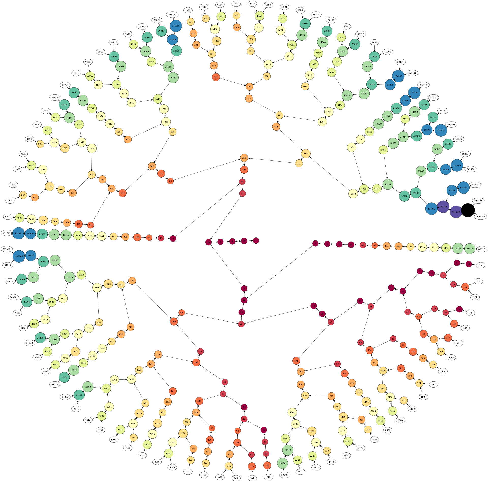
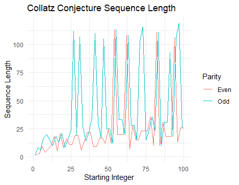

# Collatz Conjecture Analysis

In this Collatz Conjecture analysis, we will explore the different types of data and visualizations of Collatz Conjecture.



## Background

The Collatz Conjecture is a mathematical conjecture concerning a sequence defined as follows. Start with any positive integer `n`. Then each term is obtained from the previous term according to these rules:

1.  If the previous term in even, the next term is one half of the previous term.
2.  If the previous term is odd, the next term is 3 times the previous term plus 1.

The Conjecture is that no matter what value of `n`, the sequence will always reach 1.

note: To start the tasks below, we will be using the packages `{tidyverse}` for data wranglings and `{ggplot2}` for data visualisations.

## Tasks

### 1) Generating the Collatz Conjecture

-   At first, we created a function called `gen_collatz` that takes a positive integer `n` as input where the input `n` is invalid to generate the Collatz sequence until it reaches 1.

-   Then we apply this function to all integers from 1 to 10,000 and store the results in a tibble named `collatz_df`. Here, we will include:

1.  `start` (starting integers) from 1 to 10000.
2.  `seq` (the Collatz sequence saved as a list) using `lapply()` which takes a list, vector, or data frame as input and gives output as a list object. [\^1]
3.  `length` (the length of the sequences) using `map_dbl()` which returns a numeric vector. [\^2]
4.  `parity` (the starting integers' identity as even or odd), and
5.  `max_val` (the maximum value reached in each sequences)

-   The `collatz_df` tibble will look like this:

``` r
collatz_df
# A tibble: 10,000 × 5
   start seq    length parity max_val
   <int> <list>  <dbl> <chr>    <dbl>
 1     1 <dbl>       1 Odd          1
 2     2 <dbl>       2 Even         2
 3     3 <dbl>       8 Odd         16
 4     4 <dbl>       3 Even         4
 5     5 <dbl>       6 Odd         16
 6     6 <dbl>       9 Even        16
 7     7 <dbl>      17 Odd         52
 8     8 <dbl>       4 Even         8
 9     9 <dbl>      20 Odd         52
10    10 <dbl>       7 Even        16
# ℹ 9,990 more rows
```

### 2) Exploratory data analysis

By using `{tidyverse}` data wrangling techniques, we can find the answers to the following questions:

**1. The top 10 starting integers that produce the longest sequences.**

-   Here, we first arrange the length of the sequences from the longest to shortest, and since we only need to know the top 10 longest sequences, we will use `slice_head(n = 10)` and `select(start)` to return only the column of starting integers with the top 10 longest sequences. We will transpose (`t()`) `top10longest` and save it as a tibble (`as_tibble`) [\^3] for easier computation.

-   The outcome will be:

``` r
top10longest
# A tibble: 1 × 10
     V1    V2    V3    V4    V5    V6    V7    V8    V9   V10
  <int> <int> <int> <int> <int> <int> <int> <int> <int> <int>
1  6171  9257  6943  7963  8959  6591  9887  9897  7422  7423
```

**2. Starting integer produces a sequence that reaches the highest maximum value.**

-   Similar to the previous question, we will arrange `max_val` in a descending order to find the most maximum integer reached in the sequences, and what the starting integer is, then we use `head(1)` and `select(start)` to only return the value of the starting integer with the maximum value reached in its sequence.

-   The outcome will show that starting integer with the maximum value reached in its sequence is 9663:

``` r
max_val_int
      [,1]
start 9663
```

**3. The average length of the sequence for even starting integers compared to odd ones.**

-   Since we are comparing the even starting integers with the odd ones, we will use `group_by(parity)` to group even starting integers together and odd starting integers together. Then we can summarise the average length by using `summarise(mean(length))` to return only two values, average length of even starting integers and average length of odd starting integers.

-   The outcome will be:

``` r
even_odd_avg_len
       [,1]    [,2]
avg 79.5936 92.3396
```

**4. The standard deviation of the sequence for even starting integers compared to odd ones.**

-   To find the standard deviation, we can use the same code to find the average length, with the difference of using `summarise(sd(length))` instead of `summarise(mean(length))`.

-   The outcome will be:

``` r
even_odd_sd_len
       [,1]     [,2]
sd 45.10308 47.18387
```

### 3) Investigating "backtracking" in sequences.

In this task, we explore the concept of "backtracking" within the Collatz sequences. Backtracking occurs when a sequence reaches a value that is less than the starting integer, but then increases again above the starting integer at least once before reaching 1.

**1. Starting integers that exhibit backtracking in their sequences.**

``` r
a_backtracking <- function(seq, start) {
  value_less_than_start <- FALSE
  
  for (value in seq) {
    if (value < start) {
      value_less_than_start <- TRUE
    }
    if (value_less_than_start & value > start) {
      return(TRUE)
    }
    if (value == 1) {
      break
    }
  }
  return(FALSE)
}
```

``` r
backtracks_df <- collatz_df %>%
  filter(pmap_lgl(list(seq, start), a_backtracking))
```

A tibble will be formed:

``` r
backtracks_df
# A tibble: 8,229 × 5
   start seq        length parity max_val
   <int> <list>      <dbl> <chr>    <dbl>
 1     6 <dbl [9]>       9 Even        16
 2     7 <dbl [17]>     17 Odd         52
 3     9 <dbl [20]>     20 Odd         52
 4    10 <dbl [7]>       7 Even        16
 5    11 <dbl [15]>     15 Odd         52
 6    12 <dbl [10]>     10 Even        16
 7    13 <dbl [10]>     10 Odd         40
 8    14 <dbl [18]>     18 Even        52
 9    15 <dbl [18]>     18 Odd        160
10    17 <dbl [13]>     13 Odd         52
# ℹ 8,219 more rows
# ℹ Use `print(n = ...)` to see more rows
```

**2. Most frequently occurring number of time sequences go above their starting integer for sequences that backtracks.**

  
``` r
max_count <- function(seq, start) {
  sum(seq > start)
}

count_df <- backtracks_df %>%
  mutate(count=pmap_int(list(seq,start),max_count))

mode_backtrack <- count_df %>%
  group_by(count) %>%
  summarise(seq_count = n()) %>%
  filter(seq_count == max(seq_count)) %>%
  pull(count)
```

The outcome will be:
  
``` r
[1] 1
```

**3. Maximum value reached after the first backtrack for these sequences.**

```r
max_val_reached <- function(seq, start) {
  value_less_than_start <- FALSE
  max_val <- 0
  
  for (value in seq) {
    if (value < start) {
      value_less_than_start <- TRUE
    }
    if (value_less_than_start & value > start) {
      max_val <- max(max_val,value)
    }
    if (value == 1) {
      break
    }
  }
  return(max_val)
}

max_after_backtrack <- backtracks_df %>%
  mutate(max_val_reached = pmap_dbl(list(seq, start), max_val_reached)) %>%
  select(max_val_reached)

max_after_backtrack <- t(max_after_backtrack)
```

**4. Are backtracking sequences more common among even or odd starting integers?**

``` r
even_odd_backtrack <- backtracks_df %>%
  count(parity, name = "count") %>%
  select(count)

even_odd_backtrack <- t(even_odd_backtrack)
```

The outcome will show that backtracking sequences are more common among odd integers:
  
  ``` r
[,1] [,2]
count 3943 4286
```

### 4) Visualisations

Below graphs will visualises the data wrangling tasks from Task 3 above.

**1. A scatterplot of all the sequence lengths.**

``` r
ggplot(data = backtracks_df,
       aes(x = start,
           y = length)
) +
  geom_point() +  
  geom_point(data = head(backtracks_df, 10), 
             aes(colour = "red"),
             size = 3) +
  labs(
    title = "The Collatz Conjecture",
    x = "Starting Integer",
    y = "Length of Sequence",
    colour = "Top 10 Starting Integer")
```

The graph obtained is as below:

.png)
  
  
We then created another scatterplot by adding limits to the code above to see the top 10 starting integers more clearly. (Note that the limits are not fixed and can be changed based on our preferences)

``` r
ggplot(data = backtracks_df,
       aes(x = start,
           y = length)
) +
  geom_point() +  
  geom_point(data = head(backtracks_df, 10), 
             aes(colour = "red"),
             size = 3) +
  labs(
    title = "The Collatz Conjecture",
    x = "Starting Integer",
    y = "Length of Sequence",
    colour = "Top 10 Starting Integer") +
  scale_x_continuous(
    limits = c(0, 2000)) +
  scale_y_continuous(
    limits = c(0,100))
```

The graph obtained is as below:

.png)


**2. A scatterplot of the highest value reached in the sequence.**

``` r
max_after_backtrack_df <- backtracks_df %>%
  mutate(max_val_reached = pmap_dbl(list(seq, start), max_val_reached))

ggplot(data = max_after_backtrack_df,
       aes(x = start,
           y = max_val_reached)) +
  geom_point() +  
  geom_point(data = head(max_after_backtrack_df, 10),
             aes(colour = factor(start)), 
             size = 5) +
  labs(
    title = "The Collatz Conjecture",
    x = "Starting Integer",
    y = "Maximum Value Reached",
    colour = "Top 10 Starting Integer")
```

The graph created is as below:

.png)

Similar to (1), we created another scatterplot to see the top 10 starting integers more clearly:
  
``` r
ggplot(data = max_after_backtrack_df,
       aes(x = start,
           y = max_val_reached)) +
  geom_point() +  
  geom_point(data = head(max_after_backtrack_df, 10),
             aes(colour = factor(start)), 
             size = 5) +
  labs(
    title = "The Collatz Conjecture",
    x = "Starting Integer",
    y = "Maximum Value Reached",
    colour = "Top 10 Starting Integer") +
  scale_x_continuous(
    limits = c(0, 500)
  ) +
  scale_y_continuous(
    limits = c(0, 500)
  )
```

The graph created is as below:

.png)


**3. A boxplot comparing the distributions of sequence lengths for even and odd integers.**

``` r
ggplot(data = backtracks_df) +
  geom_boxplot(aes(x = parity,
                   y = length)) +
  labs(
    title = "Distributions of Sequence Lengths",
    x = "Parity of Starting Integer",
    y = "Length of Sequence")
```

The graph obtained is as below:

.png)


### 5) Open-ended exploration

Our team has decided to explore an interesting question about the Collatz Conjecture sequences, and it is:

**What is the most frequent integer that appears in all the sequences combined, excluding the number 1?**

Firstly, to combine all of the numbers in the sequences, we will separate the numbers in `c()` with `unnest()` and filter the sequences to not include 1:

``` r
separated_seq <- collatz_df %>%
  unnest(seq) %>%
  filter(seq != 1) %>%
  arrange(seq)
separated_seq
```

Using the above `separated_seq`, we can find the most frequently appearing integers by filtering `n` to be \> 1 to exclude 1, then arrange `n` in descending order and here we will see the top 10 most frequently appearing integers.

``` r
most_frequent <- separated_seq %>%
  count(seq) %>%
  filter(n > 1) %>%
  arrange(desc(n)) %>%
  slice_head(n = 10)
```

The top 10 most frequently appearing integers are:

``` r
most_frequent 
# A tibble: 10 × 2
     seq     n
   <dbl> <int>
 1     2  9999
 2     4  9998
 3     8  9997
 4    16  9996
 5     5  9400
 6    10  9399
 7    20  9386
 8    40  9385
 9    80  4751
10   160  4750
```

We can see that the most frequently appearing integer in the sequences combined is 2, with 9999 appearances.

Interestingly, starting integers of powers of 2 have the shortest sequence lengths among their neighboring starting integers. Lets check their lengths with the following code. Note that `slice()` can be used to change the range of the data, e.g. `1:10`, `11:20`, `1:100`.

``` r
in10start <- collatz_df %>%
  select(start, length) %>%
  slice(1:10) %>%
  arrange(length)
```

In the first 10 starting integers, the top 4 shortest lengths have starting integers of powers of 2, which are 2, 4 and 8 (excluding 1).

``` r
in10start
# A tibble: 10 × 2
   start length
   <int>  <dbl>
 1     1      1
 2     2      2
 3     4      3
 4     8      4
 5     5      6
 6    10      7
 7     3      8
 8     6      9
 9     7     17
10     9     20
```

You can try checking the lengths for other powers of 2 such as 16, 32 and 64 and compare them with their neighbouring integers.

This is because the next terms for `2^n` starting integers are all even and only need to be divided by 2 until the sequences reach 1, unlike the other starting integers that have odd numbers in their sequences.

So, 2 is the most frequent integer (other than 1) that appears in all the sequences combined because it is the second last integer to be in a sequence before reaching 1, as 2/2 = 1.

### 6) Creative visualisation challenges

In this part of the task, we visualized some aspect of Collatz conjecture sequences by exploring *the changes of the sequence lengths over a range of starting integers*.




**Sources**

[\^1] [`lapply()` function](https://www.geeksforgeeks.org/apply-lapply-sapply-and-tapply-in-r/)
[\^2] [`map_dbl()` function](https://www.rdocumentation.org/packages/purrr/versions/0.1.0/topics/map)
[\^3] [`as_tibble()` function](https://tibble.tidyverse.org/reference/as_tibble.html#:~:text=as_tibble()%20turns%20an%20existing,()%20as%20base%3A%3Aas)
